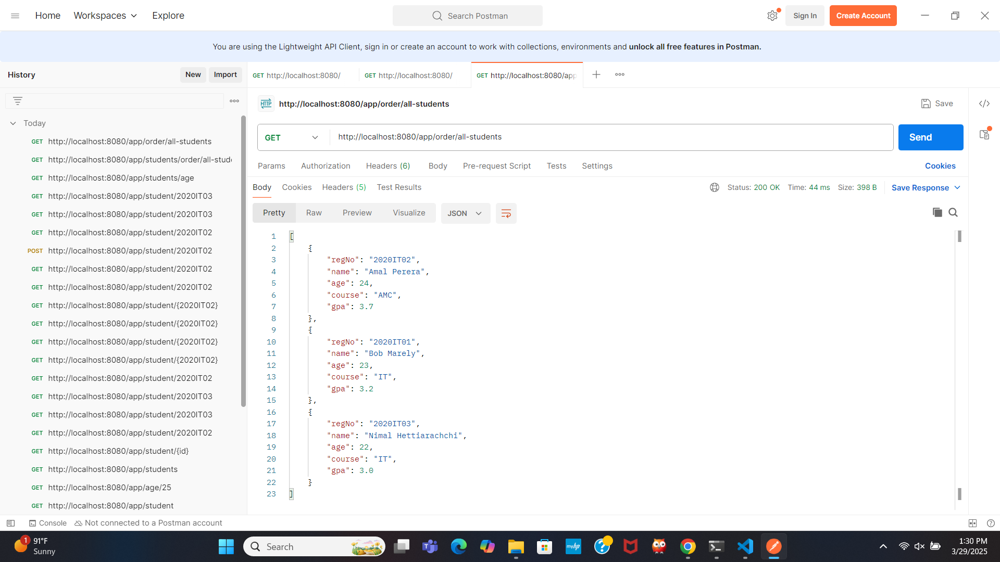
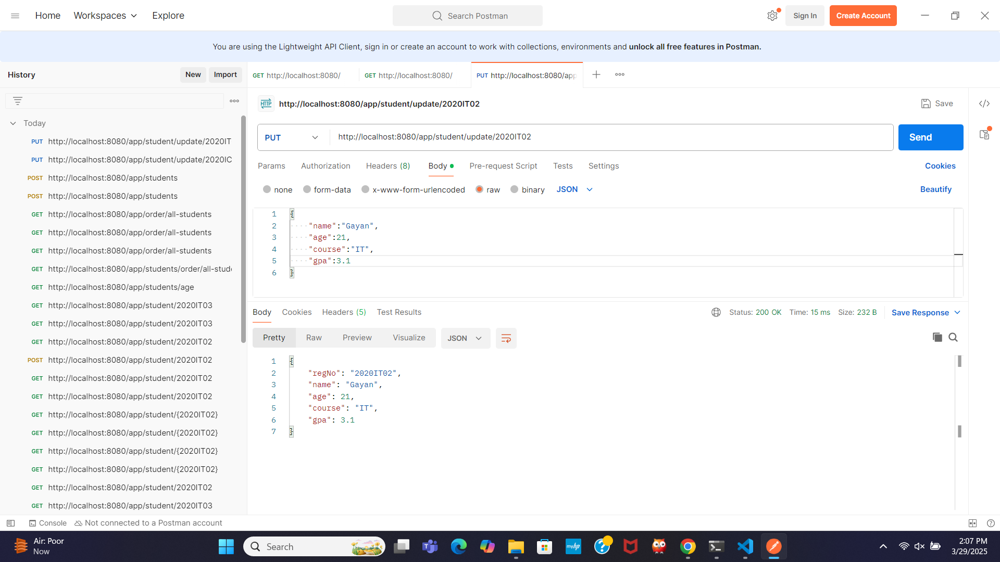

# IT3232_Day-02_Spring-Boot

# Spring Boot REST Controller & Student Management System

## 📖 Introduction

This project demonstrates a simple Spring Boot REST controller with two endpoints that return text messages.

The Student Management System is a simple RESTful web application built using Spring Boot. It allows users to perform CRUD operations (Create, Read, Update, Delete) on student data. The application also provides some additional features like filtering students by age, sorting students by GPA, and displaying student details.

##  📂 Code Structure

```java
package lk.ac.vau.fas.ict.controller;

import org.springframework.web.bind.annotation.RequestMapping;
import org.springframework.web.bind.annotation.RestController;

import lk.ac.vau.fas.myapp.model.Student;

import java.util.ArrayList;
import java.util.List;

import org.springframework.web.bind.annotation.DeleteMapping;
import org.springframework.web.bind.annotation.GetMapping;
import org.springframework.web.bind.annotation.PathVariable;
import org.springframework.web.bind.annotation.PostMapping;
import org.springframework.web.bind.annotation.PutMapping;
import org.springframework.web.bind.annotation.RequestBody;
import org.springframework.web.bind.annotation.RestController;

@RestController
@RequestMapping("/app")
public class AppController {

    Student Bob = new Student("2020IT01","Bob Marely",23,"IT",3.2);
	Student Amal = new Student("2020IT02","Amal Perera",24,"AMC",3.7);
	Student Nimal = new Student("2020IT03","Nimal Hettiarachchi",22,"IT",3.0);
    List<Student> students = new ArrayList<Student>();

    public AppController() {
        students.add(Bob);
        students.add(Amal);
        students.add(Nimal);
    }

    @GetMapping("/msg")
    public String myMessage() {
        return "Hello SpringBoot";
    }

    @GetMapping("/name")
    public String myName() {
        return "My name is SpringBoot";
    }
@GetMapping("/age/{ag}")
	public String MyAge(@PathVariable("ag") int age) {
		return "My age is "+age;
	}
    //a method to return a student
    @GetMapping("/student")
	public Student getStudent() {
		return Nimal;
	}
    //return multiple students
    @GetMapping("/students")
	public List<Student> getStudents() {
		students.add(Bob);
		students.add(Amal);
		students.add(Nimal);
		return students;
	}
    //find a student from the list by regno
    @GetMapping("/student/{id}")
	public Student getStudent(@PathVariable("id") String regNo) {
		for(Student student : students) {
			if(student.getRegNo().equals(regNo)) {
				return student;
			}
		}	
		return null;
    }
    //find the students whose age is between 20 and 23
    @GetMapping("/students/age")
    public List<Student> getStudentsByAgeRange() {
    List<Student> filteredStudents = new ArrayList<>();
    for (Student student : students) {
        if (student.getAge() >= 20 && student.getAge() <= 23) {
            filteredStudents.add(student);
        }
    }
    return filteredStudents;
}
    //sort the students by their GPA
    @GetMapping("/order/all-students")
    public List<Student> getAllStudents() {
        students.sort((s1, s2) -> Double.compare(s2.getGpa(), s1.getGpa())); 
        return students;
    }
    //create CRUD operations for students
    //create
    @PostMapping("/students")
    public Student createStudent(@RequestBody Student student) {
        students.add(student);  // Add the student to the list
        return student;
    }
    //Update
    @PutMapping("/student/update/{regno}")
    public Student updateStudent(@PathVariable("regno") String regNo, @RequestBody Student updatedStudent) {

        for (Student student : students) {
            if (student.getRegNo().equals(regNo)) {
                student.setName(updatedStudent.getName());
                student.setAge(updatedStudent.getAge());
                student.setCourse(updatedStudent.getCourse());
                student.setGpa(updatedStudent.getGpa());
                return student;
            }
        }
        return null;
    }
    //Delete
    @DeleteMapping("/student/delete/{regno}")
    public String deleteStudent(@PathVariable("regno") String regNo) {
        for (Student student : students) {
            if (student.getRegNo().equals(regNo)) {
                students.remove(student);
                return "Student with regNo " + regNo + " has been deleted."; 
            }
        }
        return "Student with regNo " + regNo + " not found."; 
    }
}
```

```java
package lk.ac.vau.fas.myapp.model;

public class Student {
    private String regNo;
	private String name;
	private int age;
	private String course;
	private double gpa;

    public Student(String regNo, String name, int age, String course, double gpa) {
        this.regNo = regNo;
        this.name = name;
        this.age = age;
        this.course = course;
        this.gpa = gpa;
    }

    public String getRegNo() {
        return regNo;
    }

    public void setRegNo(String regNo) {
        this.regNo = regNo;
    }

    public String getName() {
        return name;
    }

    public void setName(String name) {
        this.name = name;
    }

    public int getAge() {
        return age;
    }

    public void setAge(int age) {
        this.age = age;
    }

    public String getCourse() {
        return course;
    }

    public void setCourse(String course) {
        this.course = course;
    }

    public double getGpa() {
        return gpa;
    }

    public void setGpa(double gpa) {
        this.gpa = gpa;
    }
}

```

## 📝 Code Explanation &  🚀 How to run
1. **`@RestController`**:
   - Marks the `AppController` class as a REST controller that handles HTTP requests.
2. **`@RequestMapping("/app")`**:
    - Specifies the base URL for the controller.
3. **Endpoints**:
   - **`@GetMapping("/msg")`**:Returns the message `"Hello SpringBoot"` when accessed at `/app/msg`.
    
   - **`@GetMapping("/name")`**:Returns the message `"My name is SpringBoot"` when accessed at `/app/name`.
     
   - **`@GetMapping("/age/{ag}")`**:Returns the message `"My age is {age}"`, where {age} is the value provided in the URL. For example, accessing `/app/age/25` will return `"My age is 25"`.
     
   - **`@GetMapping("/student")`**:Returns the details of a single student (Nimal Hettiarachchi) when accessed at `/app/student`.
     
   - **`@GetMapping("/students")`**:Returns a list of all students when accessed at `/app/students`.
     
   - **`@GetMapping("/student/{id}")`**:Returns the details of a student specified by their registration number when accessed at `/app/student/{id}`. For example, `/app/student/2020IT03` will return the details of Nimal Hettiarachchi.
     
   - **`@GetMapping("/students/age")`**:Returns a list of students whose age is between 20 and 23 when accessed `at /app/students/age`.
     
   - **`@GetMapping("/order/all-students")`**:Returns a list of all students sorted by their GPA in descending order when accessed at `/app/order/all-students`.
    
   - **`@PostMapping("/students")`**:Creates a new student when accessed via POST at `/app/students`. The student details should be passed in the request body. Example request body:
    ```json
    {
    "regNo": "2020IT04",
    "name": "Sandun",
    "age": 20,
    "course": "AMC",
    "gpa": 3.5
    }
    ```
    - **`@PutMapping("/student/update/{regno}")`**:Updates an existing student’s details using their registration number when accessed at     `/app/student/update/{regno}`. For example, to update BAmal Perera's information, access `/app/student/update/2020IT02`. The updated student details should be provided in the request body. Example request body:
    ```json
    {
    "regNo": "2020IT02"
    "name": "Gayan",
    "age": 21,
    "course": "IT",
    "gpa": 3.1
    }
    ```
    - **`@DeleteMapping("/student/delete/{regno}")`**:Deletes a student by their registration number when accessed at `/app/student/delete/{regno}`. For example,     to delete Bob Marely, access `/app/student/delete/2020IT01`.Example response:
     Student with regNo 2020IT01 has been deleted.

## 📈  Output Screenshots
### 1. `/app/msg` Endpoint Output:


### 2. `/app/name` Endpoint Output:


### 3. `/age/{ag}` Endpoint Output:


### 4. `/app/student` Endpoint Output:


### 5. `/app/students` Endpoint Output:


### 6. `/app/student/{id}` Endpoint Output:


### 7. `/app/students/age` Endpoint Output:


### 8. `/app/order/all-students` Endpoint Output:


### 9. `/app/students` Endpoint Output:


### 10. `/app/student/update/{regno}` Endpoint Output:


### 11. `/app/student/delete/{regno}` Endpoint Output:


## ⚙️ Technologies
- Java: The core programming language used.

- Spring Boot: Framework for creating REST APIs.

- Spring Web: Handles web requests with annotations like `@RestController` and `@GetMapping`.

- Maven: For project management and dependency management.

## 🌟 Features
- RESTful Endpoints: Two endpoints (/app/msg and /app/name) for handling GET requests.

- Lightweight Web Server: Uses Spring Boot's embedded Tomcat server.

- Simple Text Responses: Returns basic messages as HTTP responses.

- Annotation-Based Configuration: Demonstrates Spring annotations like `@RestController` and `@RequestMapping`.
- View student by registration number: Retrieve student details using the registration number.
- View all students: Retrieve a list of all students in the system.
- View students by age range: Retrieve students whose age is between 20 and 23.
- Sort students by GPA: Sort students in descending order based on their GPA.
- Create a new student: Add a new student to the system.
- Update student details: Modify an existing student's details using their registration number.
- Delete a student: Remove a student from the system using their registration number.

##  📜 Summary
This showcases how to create and run a simple Spring Boot REST API with basic text responses. It demonstrates the use of annotations like `@RestController`, `@RequestMapping`, and `@GetMapping`.

This API provides functionality to manage student records, including retrieving student information, adding new students, updating existing records, and deleting students. It also includes features for filtering and sorting student data based on specific criteria like age and GPA.


